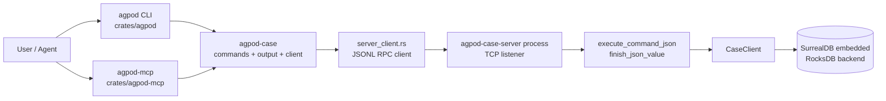
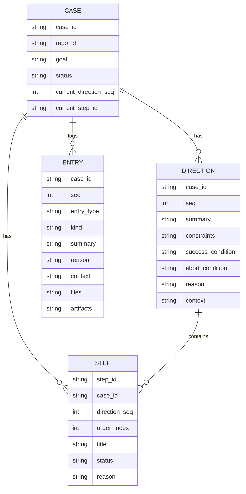
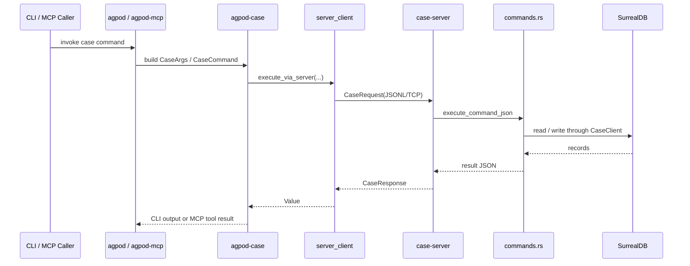
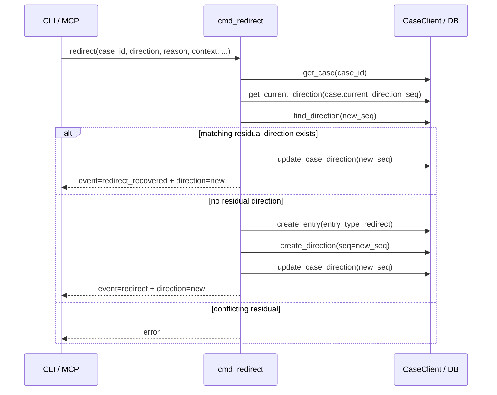
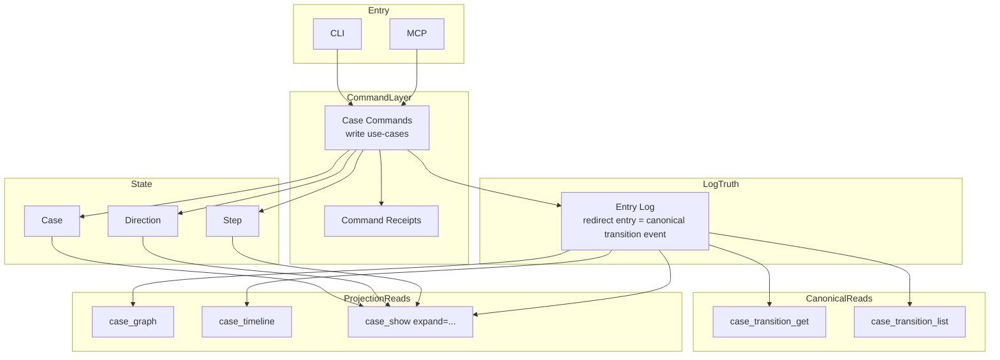

# Case System Architecture

本文为 case system 之**统一架构文**。

本文已并入先前 `design.md` 之核心结论，并以现有仓库代码为准，明确区分：

- **现已实现**
- **目标设计**
- **尚未实现**

本文不再把 `design.md` 视为独立真理源，而以本文为当前主文档。

## 1. Executive Summary

case system 现状可概括为：

- **入口有二**：CLI 与 MCP
- **命令核心唯一**：皆经 `agpod-case` 命令层
- **执行通道统一**：默认经 `case-server` 走 JSONL RPC
- **持久化中心唯一**：`agpod-case` 的 `CaseClient` 访问 SurrealDB embedded / RocksDB
- **repo identity 是一等边界**：所有 case 查询与隔离皆以 `repo_id` 为真实分区边界
- **现系统兼具状态模型与事件日志**：`case` / `direction` / `step` 维持当前状态，`entry` 提供 append-only log 雏形
- **读写模型当前未分离**：命令实现直接返回面向 CLI/MCP 的 JSON 结果

### 当前最终判断

经本轮架构分析、`oracle` 评审、`zeus` 复评后，当前推荐方向如下：

1. 不应另造一套与 `entry` 平行且同等权威的 transition 真相库
2. **`entry_type=redirect` 应升格为 canonical transition event**
3. `transition` 更适合作为：
   - 概念模型
   - typed read model
   - graph / timeline / query projection
4. `case_redirect` 长期不应以 full transition 回执充当主要读模型
5. 但“是否临时返回较胖结果”是实现策略问题，不是绝对架构禁令

## 2. Implementation Status Legend

- **Implemented**：仓内代码已存在
- **Partially Implemented**：已有雏形，但未达目标设计
- **Not Implemented**：本文所述为目标设计，代码尚无对应实现

## 3. Crate & Runtime Topology

### Status

- CLI entry via `crates/agpod` — **Implemented**
- MCP entry via `crates/agpod-mcp` — **Implemented**
- shared command core in `crates/agpod-case` — **Implemented**
- JSONL RPC server/client path — **Implemented**
- single DB access gate in server — **Implemented**

## 4. Layered Architecture

### 4.1 Entry Layer

- CLI：面向人类终端与 shell
- MCP：面向 agent/tool 调用

二者皆是 adapter，不是 case 领域本体。

**Status**：**Implemented**

### 4.2 Command Layer

位于 `crates/agpod-case/src/commands.rs`。

职责：

- 将 `CaseCommand` 分发到具体 `cmd_*`
- 执行业务规则
- 组织返回 JSON

**Status**：**Implemented**

### 4.3 Transport Layer

位于：

- `server_client.rs`
- `server.rs`
- `rpc.rs`

职责：

- 通过 JSONL over TCP 传输 `CaseRequest` / `CaseResponse`
- 共用 case-server
- 以 `db_gate` 串行化数据库访问

**Status**：**Implemented**

### 4.4 Persistence Layer

位于 `client.rs`。

职责：

- 连接 SurrealDB embedded
- 建 schema
- 按 repo identity 做隔离
- 提供 CRUD / query helper

**Status**：**Implemented**

### 4.5 Presentation / Contract Layer

位于：

- `output.rs`
- `agpod-mcp/src/lib.rs` 中之 `ToolEnvelope`

职责：

- 将领域结果转为 CLI 文本或 JSON
- 将 `agpod-case` JSON 包装成 MCP 稳定 contract（如 `result.kind` / `result.case_id` / `result.state` / `result.raw`）

**Status**：**Implemented**

### 4.6 Read Model Separation

目标上，应将读取分为：

- canonical reads
- projection reads

但现系统尚未独立分层；当前由 `commands.rs` 直接拼出多种结果视图。

**Status**：**Not Implemented**（仅有 command-built JSON projections）

## 5. Current Facts in the System

现系统较严谨之说，有三层事实。

### 5.1 Stateful aggregate

- `case`

其保存：

- 全局目标
- 当前状态
- `current_direction_seq`
- `current_step_id`
- repo/worktree 边界信息

**Status**：**Implemented**

### 5.2 Stateful snapshots / branches

- `direction`
- `step`

其保存：

- 某阶段之方向定义
- 某方向下之执行队列

**Status**：**Implemented**

### 5.3 Append-only log

- `entry`

其保存：

- `record`
- `decision`
- `redirect`

`entry` 已是现系统最接近事件流之物。

**Status**：**Implemented**

## 6. Current Domain Model

### Key reality

当前并无独立 `transition` 表或 `Transition` 持久化实体。

现有 `redirect` 语义，被拆散表达于：

- `entry(entry_type = redirect)`
- `direction(seq = new_seq)`
- `case.current_direction_seq = new_seq`

### Status

- `case` / `direction` / `step` / `entry` schema — **Implemented**
- independent `transition` entity/table — **Not Implemented**

## 7. Current Command Flow

### 7.1 Generic command flow

**Status**：**Implemented**

### 7.2 `redirect` flow today

**Status**：**Implemented**

## 8. Partial Write / Recovery Is the Real Driver

`cmd_redirect` 最关键之架构事实，在于其是**多步写**：

- `create_entry`
- `create_direction`
- `update_case_direction`

且现代码已显式处理 **partial redirect residue**：

- 若下一 direction 已写，而 case 指针未更新，则走 `redirect_recovered`
- 若残留与本次请求不一致，则报冲突

故 canonical transition 之需求，首先来自：

1. 写一致性
2. 幂等恢复
3. 审计一致性
4. 然后才是 UI / replay / automation

### Status

- partial-write recovery branch — **Implemented**
- canonical transition fact model — **Not Implemented**

## 9. Merged Design Decision

本节为本文并入 `design.md` 后之**当前推荐设计**。

### 9.1 Final architectural direction

**推荐方向**：

- **不要**立刻新造一张与 `entry` 平行且同等权威的 transition truth table
- **要**把 `entry_type=redirect` 升格为 **canonical transition event**
- `transition` 在读取层呈现为：
  - typed view
  - API shape
  - graph / timeline projection

一句话：

> 存储上，redirect truth 优先落在 redirect entry；读取上，再投影出 `Transition`。

### 9.2 Why this direction won

此方向综合了：

- `oracle`：避免双重真相；顺现有 append-only log 而长
- `zeus`：用户/agent 更容易理解“一条时间线 + 强类型 redirect event”

### 9.3 What is explicitly rejected

下列方案不再作为当前首推：

- “独立 transition 表 + entry 仍保留 redirect 且二者同等权威”
- “让 `case_redirect` 长期以内联 full transition 充当主要读模型”
- “仅靠事后推导 projection，而无稳定 canonical redirect fact”

## 10. Transition Materialization Options

### Option A: New `transition` table

将 transition 作为独立实体持久化。

**Pros**
- 语义清
- graph / analytics 查询较直

**Cons**
- 容易与 `entry.redirect` 双写真相
- 需解决 atomicity / sync / replay merge

**Status**：**Not Implemented**；**Not current preferred option**

### Option B: Enriched redirect entry

不新增 `transition` 表，而将 `entry_type = redirect` 扩展为 canonical transition fact。

建议其未来承载：

- stable transition id
- from snapshot
- to snapshot
- status: `created | recovered | conflicted`
- recovery metadata

**Pros**
- 顺现有 event log 架构
- 避免双重真相
- audit / replay / timeline 最自然

**Cons**
- `entry` subtype 将不完全对称
- 需更强 schema 与 typed projection

**Status**：**Partially Implemented**

已实现之部分：
- `redirect` 已写入 `entry`
- `redirect_recovered` 已有恢复分支与结果类型

未实现之部分：
- redirect entry 仍非 canonical strong-schema fact
- 尚无 stable transition id
- 尚无 from/to snapshots persisted in entry
- 尚无 `status` 字段统一表达 `created/recovered/conflicted`

### Option C: Derived projection only

仅由 `entry + direction + case pointer` 推导 transition view。

**Status**：现系统事实上接近此状态，但并非可靠长期方案。

结论：
- **Partially Implemented as current reality**
- **Not preferred as final architecture**

## 11. Target Read Model

### 11.1 Canonical reads

目标上应有：

- `case_transition_get`
- `case_transition_list`

用途：

- 读取 canonical transition facts
- 支持稳定 query / replay / automation

**Status**：**Not Implemented**

### 11.2 Projection reads

目标上应有：

- `case_graph`
- `case_timeline`
- 或 `case_show(expand=...)`

用途：

- UI 第一屏
- graph view
- timeline view
- richer case review

**Status**：**Not Implemented**

### 11.3 Current reads

当前已有：

- `case_current`
- `case_show`
- `case_list`
- `case_recall`
- `case_resume`

其本质是 command-layer built JSON projections，而非独立 read model。

**Status**：**Implemented**

## 12. Target Receipt Model

`case_redirect` 长期目标，不应以 full transition 充当主要读模型。

更稳之目标回执，应偏向：

- `transition_ref`
- `summary`
- `state`
- `next_action`

但此是目标接口方向，不是现实现状。

### Current status

当前 `case_redirect` 返回：

- `event`
- `direction`
- `steps`
- `context`
- `next`

仍属“写 + 读投影混合回执”。

**Status**：
- receipt-only redirect response — **Not Implemented**
- mixed event + direction response — **Implemented**

## 13. MCP Contract Impact

未来若改 `case_redirect` 回执，MCP 层不可忽视。

`agpod-mcp` 目前提供：

- `ToolEnvelope`
- `result.kind`
- `result.case_id`
- `result.state`
- `result.raw`

此层是 contract stabilizer，不只是展示层。

### Status

- envelope stabilization layer — **Implemented**
- transition-specific MCP read tools — **Not Implemented**

## 14. Recommended Architecture Diagram

### Status reading of this diagram

- Entry / Command / State / EntryLog path — **Implemented in substance**
- `redirect entry = canonical transition event` — **Not Implemented yet; target design**
- CanonicalReads / ProjectionReads dedicated APIs — **Not Implemented**

## 15. What Is Not Implemented Yet

以下为本轮 merged architecture/design 中**明确尚未实现**者：

1. redirect entry 的 strong-schema canonical transition 化
2. stable `transition_id`
3. persisted `from_direction_snapshot`
4. persisted `to_direction_snapshot`
5. unified transition `status`（如 `created/recovered/conflicted`）
6. dedicated transition read APIs
7. dedicated graph / timeline read APIs
8. receipt-only `case_redirect` response
9. 将 `design.md` 旧版“独立 transition record”口径全部清理为新结论

## 16. What Is Already Implemented

以下为本轮设计依托之**现已实现基础**：

1. CLI / MCP 共用 command core
2. case-server + JSONL RPC 通道
3. repo-scoped case isolation
4. `case/direction/step/entry` 四表模型
5. `entry_type=redirect` 写入
6. redirect partial-write recovery (`redirect_recovered`)
7. `case_current/show/list/recall/resume` 等读取命令
8. MCP envelope stabilization

## 17. Next Documentation Step

若继续推进，下一份最该写之文档应是：

- `transition-schema.md`

其当回答：

- redirect entry 如何扩 schema
- 哪些字段为 canonical truth
- transition view 如何自 entry 投影
- CLI JSON / MCP contract 如何演化

## 18. Final Conclusion

一句话总结：

> case system 当前是“统一命令层 + 统一 server 通道 + state model + append-only entry log + 写读混合回执”的架构；当前最优方向不是平行新增一套 transition 真相表，而是把 `entry_type=redirect` 升格为 canonical transition event，并在读层投影出 `Transition`、graph、timeline 等结构。该方向当前尚未实现，现代码仍处于 `entry + direction + case pointer` 共同表达 redirect 语义之阶段。
