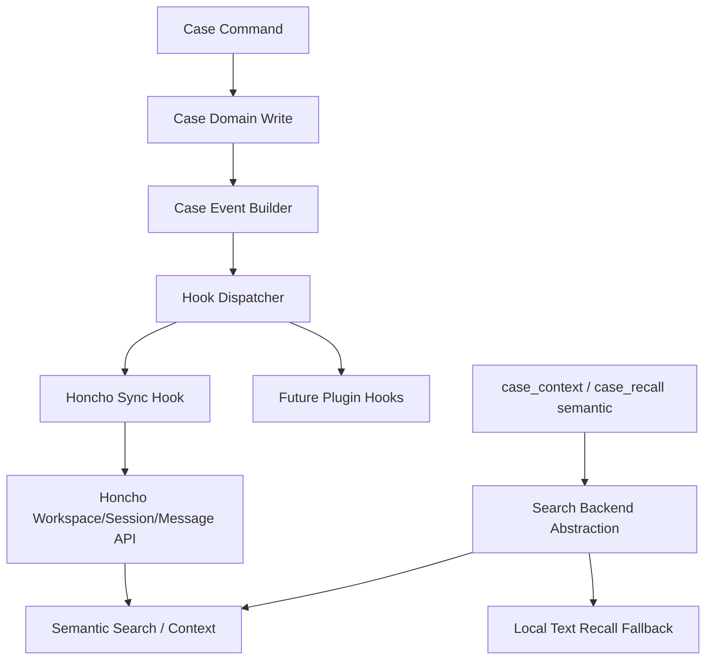

# Case → Honcho 集成方案

本文据现有代码与 Honcho v2 文档，给出自底层架构至集成路径之实施方案。

## 1. 问题定义

你想要之目标，可拆三层：

1. `case` 底层架构更丰富，可承插件 / hooks
2. 合格数据可同步至 Honcho，由 Honcho 负责 vector digest
3. agent 可用近似 `.context("自然语言搜索语句")` 之方式，取得当前 case 的语义上下文

当前代码仅达：

- `case` 为 canonical state + event log
- `case_recall` 为文本检索
- 配置旗标已预留语义召回与向量 digest 开关

故此案本质不是“接个 API”而已，而是要先补 **事件扩展层** 与 **搜索抽象层**。

## 2. 现状判断

## 2.1 已实现之基础

- 单一命令层：`crates/agpod-case/src/commands.rs`
- 单一 server 通道：`crates/agpod-case/src/server.rs`
- 单一持久层：`crates/agpod-case/src/client.rs`
- repo-scoped identity
- `entry` append-only log
- `case_recall` 命令入口
- MCP 稳定 envelope：`crates/agpod-mcp/src/lib.rs`
- 语义召回相关配置旗标：`crates/agpod-case/src/config.rs:23`

## 2.2 未实现之关键缺口

- 写操作后统一事件发布口
- 插件 / hook runtime
- 外部搜索后端抽象
- Honcho adapter
- 语义检索结果之统一返回模型
- `.context(query)` 对应之命令 / tool

## 3. 核心设计原则

### 3.1 真相不外包

case 真相仍在本仓数据库：

- `case`
- `direction`
- `step`
- `entry`

Honcho 只作：

- semantic index / memory service
- context synthesis
- cross-case retrieval aid

不可让 Honcho 反向决定本仓业务状态。

### 3.2 同步对象以 event 为主

不应同步“当前快照全文”作唯一输入；应同步 **增量事件**：

- entry
- step 状态变更
- case 生命周期事件

如此方可：

- 幂等
- 可追踪
- 可重放
- 易补偿

### 3.3 先抽象，后接 Honcho

先建 trait：

- `CaseEventSink`
- `CaseSemanticSearchBackend`
- `CaseContextProvider`

再以 `HonchoBackend` 实作。

此可防未来被 Honcho API 绑死。

并当补一义：

- `HonchoBackend` 只是首个官方 adapter
- 非所有用户之强制依赖
- 最宜以 cargo feature 控之
- 关闭 feature 时，系统仍应保有 local recall / local context 能力
- 用户若接自家后端，最小只需三步：实现 trait、注册 runtime、由配置选用

## 4. 目标架构



## 5. 推荐分层

## 5.1 Event 层

新增一层 typed event，而非直接在命令里顺手调外部 API。

建议新增模块：

- `crates/agpod-case/src/events.rs`
- `crates/agpod-case/src/hooks.rs`
- `crates/agpod-case/src/search.rs`
- `crates/agpod-case/src/context.rs`

### `events.rs`

定义：

- `CaseDomainEvent`
- `CaseEventEnvelope`
- `CaseEventSource`

事件种类至少含：

- `CaseOpened`
- `CaseReopened`
- `RecordAppended`
- `DecisionAppended`
- `RedirectCommitted`
- `StepAdded`
- `StepStarted`
- `StepDone`
- `StepBlocked`
- `CaseClosed`
- `CaseAbandoned`

## 5.2 Hook 层

建议抽象：

```rust
pub trait CaseEventSink {
    async fn handle(&self, event: &CaseEventEnvelope) -> CaseResult<()>;
}
```

再由 dispatcher 统一调用。

### 运行策略

首版勿做复杂动态插件装载；先做 **进程内静态注册 hooks**：

- `NoopSink`
- `HonchoSyncSink`

待稳定后，再扩：

- external command hook
- wasm/plugin dylib
- remote webhook sink

此为“先简后繁”。

## 5.3 Search 抽象层

建议定义：

```rust
pub trait CaseSemanticSearchBackend {
    async fn search_case(&self, case_id: &str, query: &str, limit: usize) -> CaseResult<SemanticHits>;
    async fn get_case_context(&self, case_id: &str, query: Option<&str>, token_limit: Option<u32>) -> CaseResult<SemanticContext>;
}
```

并提供两实现：

- `LocalTextSearchBackend`
- `HonchoSearchBackend`

将来亦可有：

- `PgVectorSearchBackend`
- `LanceDbSearchBackend`
- `CustomHttpSearchBackend`

### 路由逻辑

- `semantic_recall_enabled = false` → 走本地文本 recall
- `semantic_recall_enabled = true` 且 Honcho 可用 → 走 Honcho
- Honcho 故障 → 快失败于 semantic 命令，但勿破坏 case 正常写入

若编译时无 `honcho` feature，则“Honcho 可用”恒为否，应静退至本地实现，而非逼用户安装无关依赖。

## 6. Honcho 映射方案

## 6.1 Workspace

建议：

- 默认一 repo 对一 workspace
- 或由配置显式指定共享 `workspace_id`

新增配置：

- `honcho_enabled`
- `honcho_base_url`
- `honcho_api_key_env`
- `honcho_workspace_id`
- `honcho_peer_id_agent`
- `honcho_peer_id_system`
- `honcho_sync_mode = sync | async`

## 6.2 Session

建议：

- 一个 `case` 对一个 `session`
- `session_id = case_id`

当 `case_open` / `case_open mode=reopen` 触发时：

- ensure workspace
- ensure session

## 6.3 Message

每个 case 事件映射为一条 message。

### 建议 message 内容

- 主文本：面向语义检索优化之自然语言摘要
- metadata：结构化字段

主文本示例：

- `redirect`: `Case C-123 redirected from direction 1 to 2 because audit scope changed. New direction: validate Honcho sync design.`
- `record`: `Evidence recorded for case C-123: Honcho session context can produce token-bounded summaries.`

metadata 建议：

- `repo_id`
- `case_id`
- `direction_seq`
- `step_id`
- `entry_seq`
- `event_type`
- `record_kind`
- `created_at`
- `worktree_id`

## 7. 新命令设计

## 7.1 `case_context`

建议新增命令：

- CLI：`agpod case context --query "..." --limit 5 --token-limit 2000`
- MCP tool：`case_context`

返回：

- `source = honcho | local_text`
- `query`
- `hits`
- `context`
- `next`

此命令即你设想之 `.context("自然语言搜索语句")` 之正式宿主。

### 语义

若传 query：

- 对当前 case 做自然语言检索
- 再组合命中片段与会话上下文

若不传 query：

- 直接取当前 case 的 context packet

## 7.2 `case_recall` 演进

`case_recall` 仍保留“跨 case 搜历史案例”职责。

后续可分两档：

- `case_recall`：跨 case 搜历史
- `case_context`：当前 case 取上下文

勿把二者混成一个命令。

## 8. 写路径接入点

当前最合适之接入点，不在 `server.rs`，而在 `commands.rs` 成功写入之后。

### 原因

- `server.rs` 只知请求/响应，不知业务语义
- `client.rs` 只知数据库 CRUD，不宜直连 Honcho
- `commands.rs` 恰知“发生了什么业务事件”

故建议模式：

1. `cmd_*` 成功完成本地写入
2. 构造 `CaseDomainEvent`
3. 交 `HookDispatcher`
4. dispatcher 调 `HonchoSyncSink`

### 首版简化

可先只覆盖：

- `cmd_open`
- `cmd_record`
- `cmd_decide`
- `cmd_redirect`
- `cmd_close`
- `cmd_abandon`
- step status 变更

## 9. 同步模式

## 9.1 第一阶段：同步写后派发

优点：

- 简单
- 可直接观察错误

缺点：

- 写路径受外部 API 延迟影响

### 建议默认

- 本地 case 写成功后，再尝试 Honcho 同步
- Honcho 失败时：
  - 不回滚 case 真相写入
  - 记录一条本地 `record(kind=blocker|note)` 或内部错误日志
  - 明示 `sync_status = failed`

## 9.2 第二阶段：异步 outbox

稳定后建议升级为：

- 本地新增 `outbox` / `sync_job` 表
- 命令只写本地与 outbox
- 后台 worker / job pump 推送 Honcho

此更适合大量写入与 webhook 回补。

## 10. 数据结构建议

## 10.1 本地 outbox（第二阶段）

建议表：

- `sync_job`

字段：

- `job_id`
- `case_id`
- `event_type`
- `payload_json`
- `backend = honcho`
- `status = pending|running|done|failed`
- `retry_count`
- `last_error`
- `created_at`
- `updated_at`

## 10.2 event payload

须有稳定 id：

- `event_id`

建议规则：

- entry 事件：`<case_id>:entry:<seq>`
- step 事件：`<case_id>:step:<step_id>:<status>`
- lifecycle：`<case_id>:case:<action>`

此有利幂等去重。

## 11. MCP / Agent 体验

MCP 层今已有 stable envelope。

故新增 `case_context` 时，可沿用：

- `result.kind`
- `result.case_id`
- `result.state`
- `result.raw`

建议 `result.raw` 结构：

- `source`
- `query`
- `context`
- `hits`
- `token_limit`
- `search_backend`

如此 agent 便可自然形成：

- `case_current`
- `case_context(query="...")`
- `case_resume`

之工作流。

## 12. 分阶段实施路线

## 阶段 A：抽象落位

目标：先把未来接 Honcho 之缝打出来。

改动建议：

- `crates/agpod-case/src/events.rs`
- `crates/agpod-case/src/hooks.rs`
- `crates/agpod-case/src/search.rs`
- `crates/agpod-case/src/context.rs`
- `crates/agpod-case/src/lib.rs`

完成判据：

- 有 typed event
- 有 hook dispatcher
- 有 search/context traits
- 默认 noop，不改变现行为

## 阶段 B：命令层接事件派发

目标：让关键写命令产出事件。

改动建议：

- `crates/agpod-case/src/commands.rs`
- 必要时 `crates/agpod-case/src/types.rs`

完成判据：

- open/record/decide/redirect/finish/step 变更后，皆能产出标准事件
- 无 Honcho 时行为不变

## 阶段 C：Honcho adapter

目标：接官方 v2 API。

改动建议：

- `crates/agpod-case/src/honcho.rs`
- `crates/agpod-case/src/config.rs`
- `crates/agpod-core/src/lib.rs`

能力：

- ensure workspace
- ensure session
- append messages
- search session
- get session context

完成判据：

- 能将 case event 同步到 Honcho
- 能以 query 拉回当前 case context

## 阶段 D：新命令与 MCP tool

目标：向 agent 暴露 `.context(...)` 能力。

改动建议：

- `crates/agpod-case/src/cli.rs`
- `crates/agpod-case/src/commands.rs`
- `crates/agpod-case/src/output.rs`
- `crates/agpod-mcp/src/lib.rs`

完成判据：

- CLI 有 `case context`
- MCP 有 `case_context`
- 回包稳定

## 阶段 E：异步化与 webhook

目标：把同步写后派发升级为稳健同步系统。

改动建议：

- `sync_job` / outbox
- background worker
- webhook receiver（若决定反向收 Honcho 回调）

完成判据：

- 外部 API 抖动不阻塞 case 主路径
- 失败可重试
- 可观测

## 13. 风险与取舍

### 13.1 风险：命令层侵入过深

化解：

- 命令层只构造 event，不直接写 Honcho HTTP

### 13.2 风险：Honcho 故障拖慢主路径

化解：

- 第一阶段容忍同步失败但不回滚 case
- 第二阶段上 outbox

### 13.3 风险：语义检索与本地文本 recall 语义混乱

化解：

- 明确分命令：`recall` vs `context`
- 明确 `source` 字段

### 13.4 风险：未来从 v2 升 v3 成本高

化解：

- API 封装于 `HonchoBackend` trait 背后
- 业务层不知 HTTP path

## 14. 最短可行版本

若求最快见效，我建议 MVP 如下：

若 `honcho` feature 未开，或 `honcho_enabled=false`，则此 MVP 自然退化为仅保留 local recall / local context，而不要求用户安装或接入 Honcho。

1. 新增 `CaseSemanticSearchBackend` trait
2. 新增 `HonchoSearchBackend`
3. 新增 `case_context` 命令
4. `case_open` 时 ensure session
5. `record/decide/redirect` 后同步为 messages
6. `case_context(query)` 调 Honcho session search + session context

此 MVP 暂不做：

- 动态插件加载
- outbox
- webhook receiver
- cross-case semantic recall

## 15. 总结

最合理之路线不是“先把所有插件系统做满”，而是：

- 先在 `commands.rs` 与 `case_recall` 周边抽出 **事件层** 与 **搜索抽象层**
- 再以 Honcho v2 实作第一个外部语义后端
- 最后以 `case_context` 把能力显式暴露给 CLI / MCP / agent

如此既顺现有架构，也为将来 hooks / plugins 留下真正稳固之底座。
